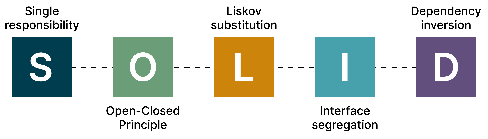

# SOLID-elvek


# Bevezetés
A mai órán a SOLID elvekről lesz szó. Hogy könnyen megértsük, egy könyvtári leltár programot fogunk írni közösen. Minden lépés egy SOLID elvnek lesz a levezetése.

## Visual Studio project setupolása
Megkérek mindenkit hogy hozzon létre egy új projektet
1. New Project a főképernyőn
2. Console application (C#) - fontos!
3. Create project (same directory)
4. “Hello World” - kód

```cs
using System;

class Program
{
    static void Main()
    {
        Console.WriteLine("Hello, World!");
    }
}
```

# Mi az a SOLID elvek?
A SOLID elvek olyan alapelvek, amelyek segítenek a szoftvertervezésben, hogy a kód könnyebben karbantartható, bővíthető és rugalmas legyen. A SOLID egy mozaikszó, ami az öt alapelv kezdőbetűiből áll össze, amit Robert C. Martin talált ki.

## S - Single Responsibility Principle (SRP)
### Jelentés
Egy osztálynak csak egy felelőssége legyen, vagyis egy dolgot csináljon.
### Példa
Egy Book osztály csak a könyvek adatait kezelje, NE foglalkozzon például a könyvek mentésével.
### Kód
1. Hozzunk létre egy “Book” és egy “Library” osztályt
Hogyan: Jobb klick a C# projektre a Solution Explorer-ben, “Add > Class”, majd a létrehozandó osztály neve
“Book.cs” osztály létrehozása
```cs
public class Book
{
    public string Title { get; set; }
    public string Author { get; set; }

    public Book(string title, string author)
    {
        Title = title;
        Author = author;
    }
}
```

2. “Library.cs” osztály létrehozása
```cs
public class Library
{
    private List<Book> books = new List<Book>();

    public void AddBook(Book book)
    {
        books.Add(book);
    }
    
    public List<Book> GetBooks()
    {
        return books;
    }
}
```

## O - Open/Closed Principle (OCP)
### Jelentés
A kód legyen nyitott a bővítésekre, de zárt a módosításokra. Tehát új funkciókat hozzá lehet adni anélkül, hogy a meglévő kódot módosítani kellene.
### Példa
A Library osztály meglévő kódjának a módosítása nélkül ki tudtuk bővíteni egy kereső művelettel.
### Kód
1. Kereső function létrehozása a “Library.cs” osztályon belül
```cs
public class Library
{
    //...

    public List<Book> Search(string keyword)
    {
        List<Book> searchResults = new List<Book>();
        foreach (var book in books)
        {
            if (book.Title.Contains(keyword) || book.Author.Contains(keyword))
            {
                searchResults.Add(book);
            }
        }
        return searchResults;
    }
}
```

## L - Liskov Substitution Principle (LSP)
### Jelentés
A Liskov-helyettesítési elv (LSP) azt mondja, hogy ha van egy osztályunk, mondjuk "Állat", és van egy alosztálya, mondjuk "Kutya", akkor bárhol, ahol "Állat" típusú objektumot használunk, gond nélkül használhatunk "Kutyát" is. Az alosztály, azaz a "Kutya", mindent tud, amit az ősosztály, azaz az "Állat" tud, és ezért bárhol, ahol egy "Állat" objektumot vár a program, ott a "Kutya" objektum is megfelelő lesz. Például az “Állat” osztálynak van egy faj neve, arra mindig tudunk hivatkozni, hiszen a “Kutyának” is muszáj lennie faj névnek.

Ez biztosítja, hogy az alosztályok helyettesíthetik az ősosztályokat anélkül, hogy a program működése megváltozna vagy hibásan működne.
### Példa
Van egy Book osztályunk, ami egy könyvet reprezentál. Készítünk egy EBook osztályt, ami egy e-könyvet reprezentál és örökli a Book osztályt. Mivel az EBook minden olyan tulajdonsággal rendelkezik, amit a Book, használhatjuk az EBook-ot is ott, ahol a program Book-ot vár, anélkül, hogy bármi gond lenne.
### Kód
```cs
public class EBook : Book
{
    public string Url { get; set; }

    public EBook(string title, string author, string url) : base(title, author)
    {
        Url = url;
    }
}
```

## I - Interface Segregation Principle (ISP)
### Jelentés
Sok, specifikus interfész jobb, mint egy általános. Tehát az interfészek legyenek kicsik és specifikusak.
### Példa
Egy IBookActions interfész csak könyvekkel kapcsolatos műveleteket tartalmazzon, míg egy IMagazineActions interfész csak magazinokkal kapcsolatos műveleteket.
### Kód
1. “ISearchEbookByTitle” és “ISearchEbookByAuthor” interface-ek létrehozása
```cs
public interface ISearchEbookByTitle
{
    List<Book> SearchByTitle(string keyword);
}

public interface ISearchEbookByAuthor
{
    List<Book> SearchByAuthor(string keyword);
}
```

2. “EBookLibrary.cs” létrehozása és a “ISearchEbookByTitle” és “ISearchEbookByAuthor” interface-ek implementálása
```cs
public class EbookLibrary : Library, ISearchEbookByTitle, 
ISearchEbookByAuthor
{
    public List<Book> SearchByTitle(string keyword)
    {
        List<Book> searchResults = new List<Book>();
        foreach (var book in books)
        {
            if (book.Title.Contains(keyword))
            {
                searchResults.Add(book);
            }
        }
        return searchResults;
    }

    public List<Book> SearchByAuthor(string keyword)
    {
        List<Book> searchResults = new List<Book>();
        foreach (var book in books)
        {
            if (book.Author.Contains(keyword))
            {
                searchResults.Add(book);
            }
        }
        return searchResults;
    }
}
```

## D - Dependency Inversion Principle (DIP)
### Jelentés
A Dependency Inversion Principle (DIP) szerint a magasabb szintű modul (állatkert szolgáltatás) ne függjön közvetlenül az alacsonyabb szintű modultól (Kutya), hanem egy absztrakciótól, mint például egy Állat interfésztől/osztálytól. Így, ha később más állatokat akarunk hozzáadni (például Macska), akkor nem kell módosítani a magasabb szintű modult, csak az absztrakciót (az Állat interfészt/osztályt).

Ez azt jelenti, hogy az állatkert szolgáltatás nem fog közvetlenül a Kutya osztályra hivatkozni, hanem az Állat interfészre, így bármilyen állatot könnyen hozzáadhatunk az állatkerthez, és a magasabb szintű logika nem változik.
## Példa
Az ILibrary interfész elválasztja a Library implementációját a Program osztálytól, így a magas szintű modul (Program osztály) csak az interfésztől függ, nem a konkrét implementációtól.

Ez a felépítés lehetővé teszi a Library könnyű cseréjét vagy bővítését anélkül, hogy módosítani kellene a Program osztályt, ezzel követve a DIP elvet.
## Kód
1. Hozzuk létre az “ILibrary” interfacet
```cs
public interface ILibrary
{
    void AddBook(Book book);
    List<Book> GetAllBooks();
    List<Book> Search(string keyword);
}
```

2. Implementáljuk a “Library” osztályba
```cs
public class Library: ILibrary
{
    //...
}
```

Források
https://csharptutorial.hu/docs/hellovilag-hellocsharp/11-modern-alkalmazasfejlesztes-alapjai/solid-elvek/
